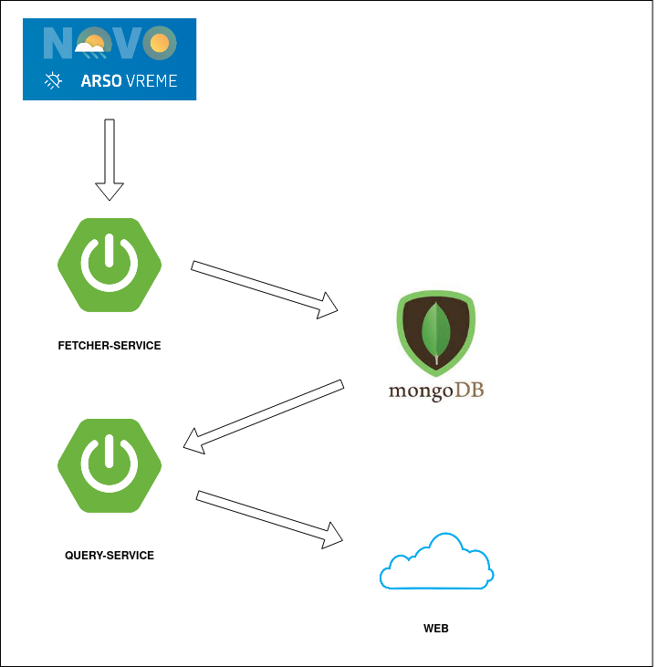

# Dhimahi employment opportunity test task for Milan Stojković

## Summary
Implement simple REST API for obtaining current weather, relaying on ARSO datasource, with endpoints as defined in the OpenAPI specification.

## Techology
- Language: Java
- Framework: Spring Boot

## Endpoints (and logic)
Endpoints are defined in openapi.yaml

## Unit tests
Unit tests with JUnit

## Not required, but bonus points for
- Code quality (organization, structure, readability)
- Usage of design patterns
- Meaningful code comments
- Descriptive loging
- Error handling
- Usage of docker container

---

### Project Schema:
<br>



---
The project is consists of two services and the database:
* Fetcher-service - responsible for fetching data from external service (Arso meteo) and store it into the database
* Query-service - responsible for querying database and serve current meteo data to the web
* Mongodb - responsible for storing data

## Building and running the project

### Prerequisites:
* maven - version 3.8.4
* docker - version 20
* java - version 17

Build :
```shell script
./build.sh
```

Start:
```shell script
./start.sh
```

Stop:
```shell script
./stop.sh
```

---

